# AppUI 自动化测试平台 - 用户流程图

## 整体用户旅程

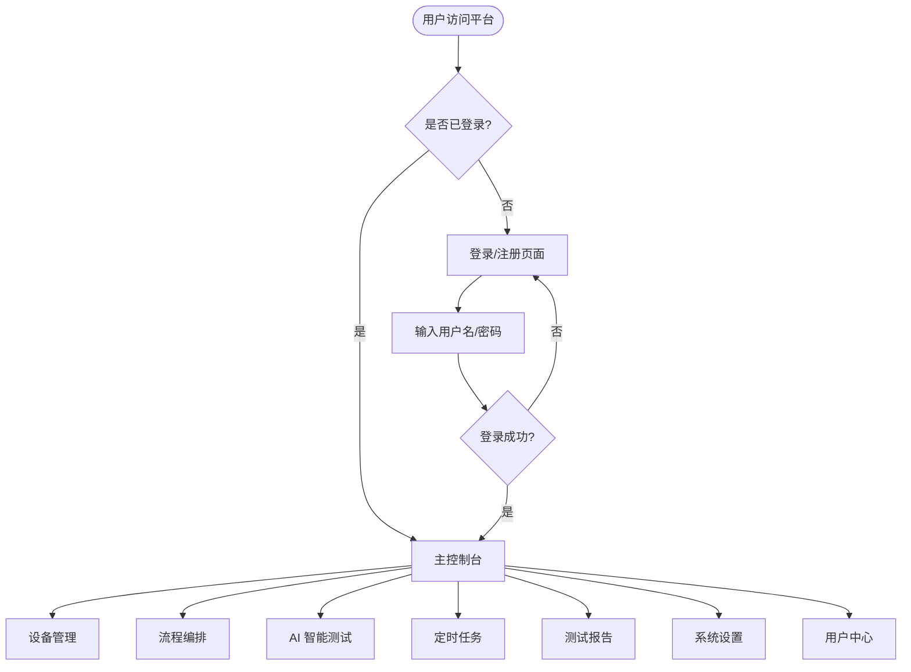

## 1. 设备管理流程

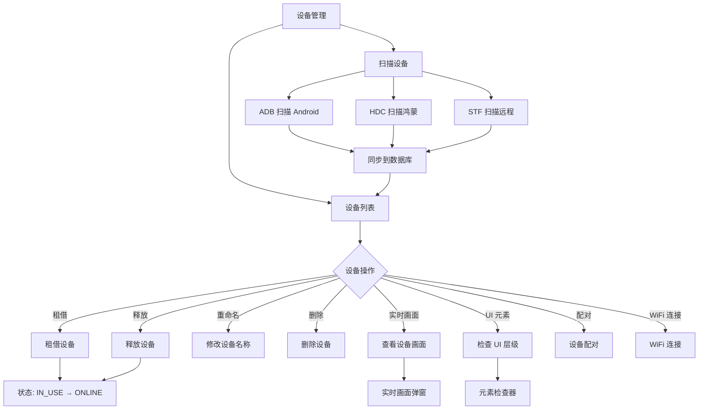

## 2. 流程编排流程

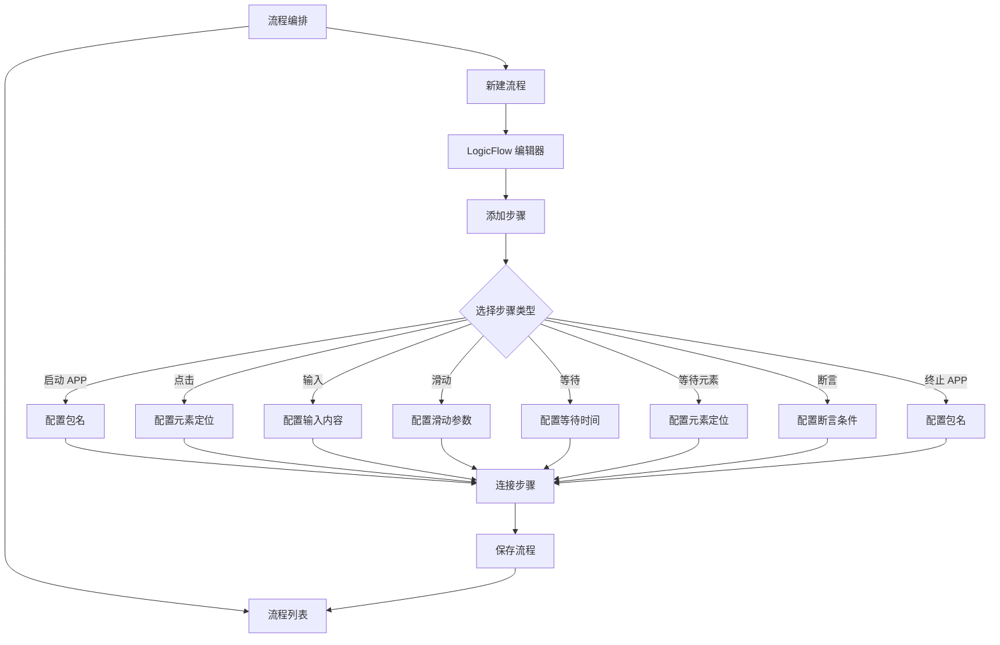

## 3. 流程执行流程

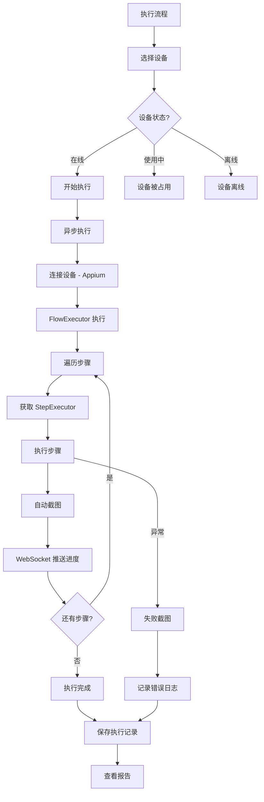

## 4. AI 智能测试流程

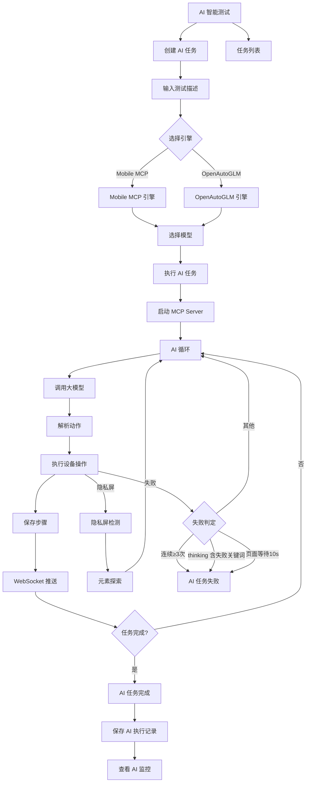

## 5. 场景录制流程

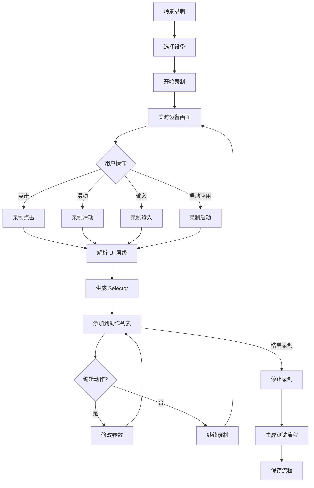

## 6. 定时任务流程

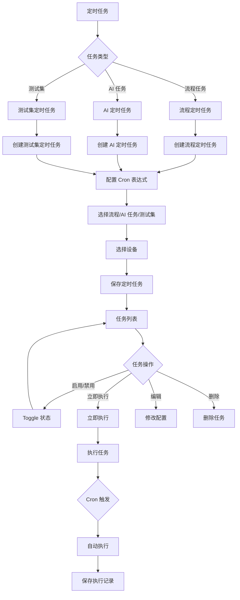

## 7. 测试集执行流程

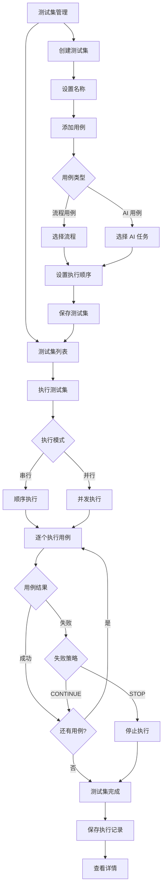

## 8. 测试报告流程

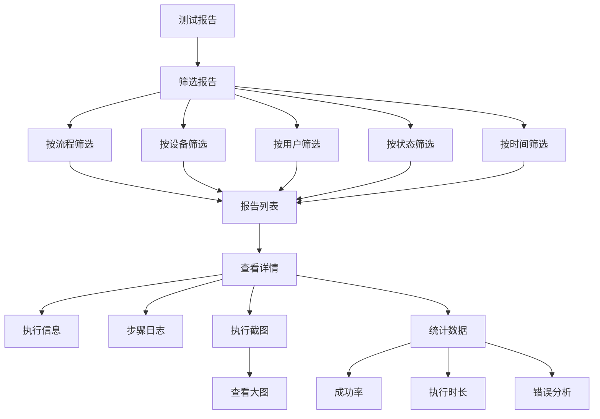

## 9. 系统设置流程

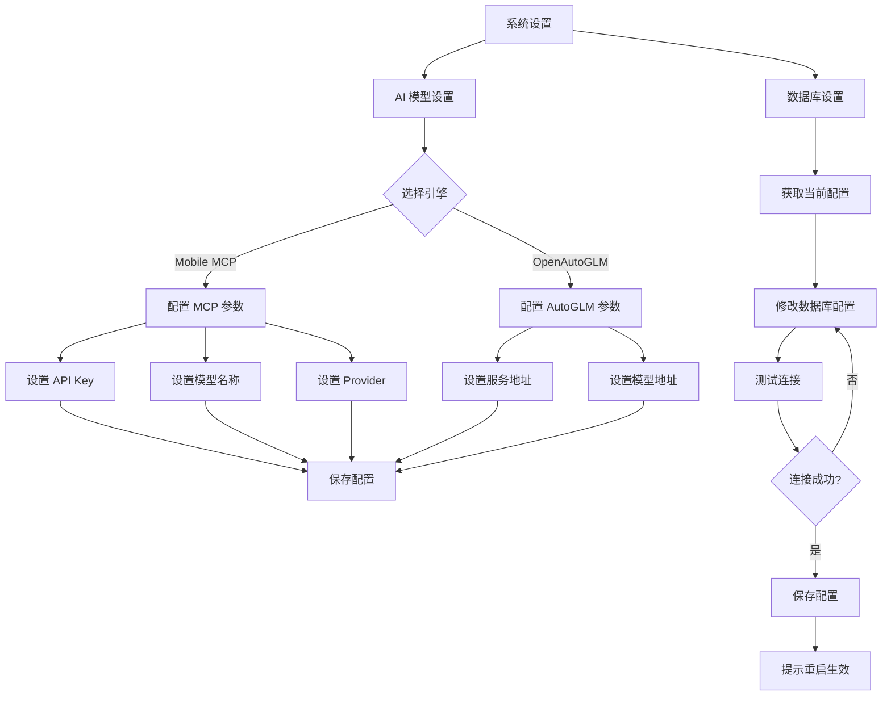

## 10. 用户中心流程

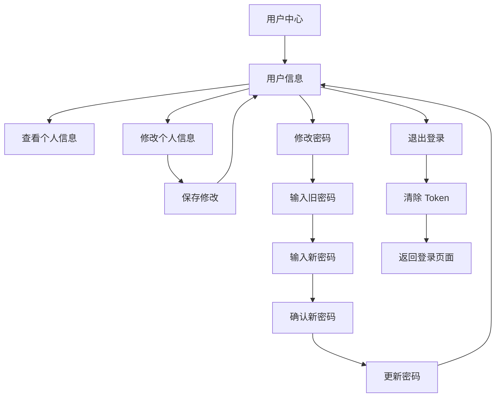

## 11. 执行监控流程

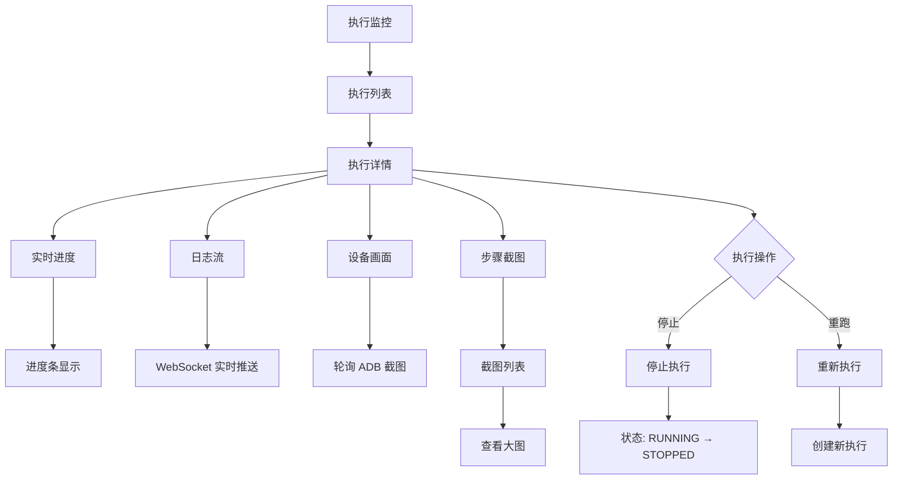

## 完整用户旅程图

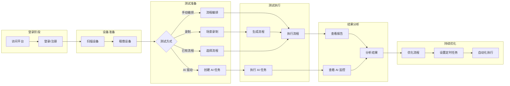

## 状态流转图

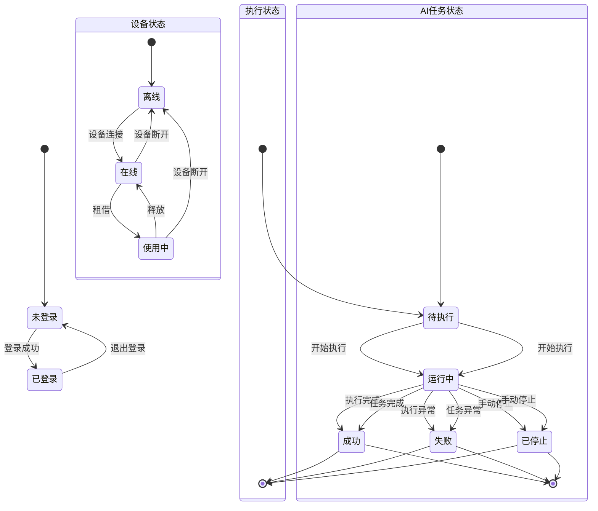
